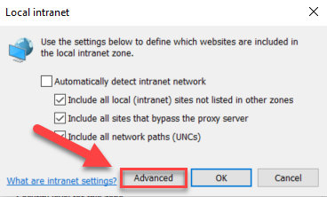

# Map-OneDrive-o365-to-QuickAccess
<h2>How to add Office 365 and OneDrive libraries to your Quick Access bar.</h2>
If you don't want to install OneDrive Sync or log into Office.com everytime you need to access a file you can setup Quick Access links to any Office 365 Sharepoint library or your OneDrive.

<ol>
<h3>Prerequisites:</h3>
            <li>Local Intranet sites - Open Internet Explorer, Open <b>Settings</b> icon at top right, choose <b>Internet Options</b>, Open <b>Security</b> tab, choose <b>Local Intranet</b> and hit <b>Sites</b> button.</li>
            <li>When you open the Sites button you'll see this screen.</li>
            
            <li>Click the <b>Advanced</b> button</li>
<ol>  
