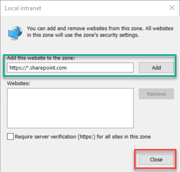
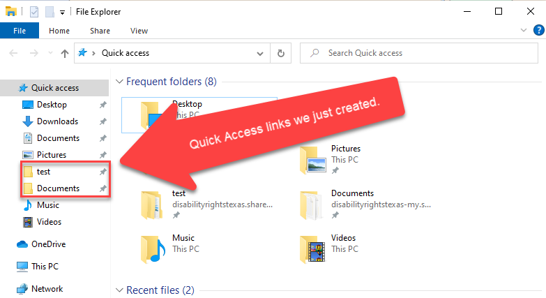
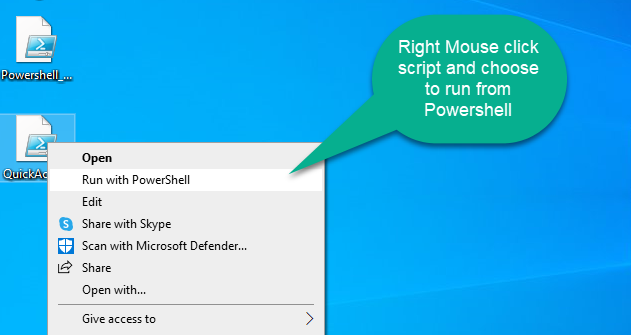

# Map-OneDrive-o365-to-QuickAccess-bar
<h2>How to add Office 365 and OneDrive libraries to your Quick Access bar.</h2>
If you don't want to install OneDrive Sync or log into Office.com everytime you need to access a file you can setup Quick Access links to any Office 365 Sharepoint library or your OneDrive.
In order to map quick access links we need to setup Intranet Zones so we're not having to login every single time. 

<ol>
<h3>Setup Intranet Zone on Internet Explorer:</h3>
            <li>Local Intranet sites - Open Internet Explorer, Open <b>Settings</b> icon at top right, choose <b>Internet Options</b>, Open <b>Security</b> tab, choose <b>Local Intranet</b> and hit <b>Sites</b> button.</li>
            <li>When you open the Sites button you'll see this screen.</li>
            
            <li>Click the <b>Advanced</b> button</li>
            <li>Now add <b>https://*.sharepoint.com</b> to the zone and choose <b>Close</b></li>
            
            <li>Your Intranet Zone is now setup.</li>
</ol>  

<h3>Powershell commands required to map to Quick Access Links:</h3>

<h4>Variables</h4>

```powershell

            $CompanyName = "disabilityrightstexas" ## full company name from Office 365 ex. "Microsoft"
            $SharepointLibrary = "Storage/test" ## site and library name ex. Storage/Test
            $DomainName = "_disabilityrightstx_org" ## full domain name including underscores ex. "_Microsoft_com"

```

<h4>Map OneDrive and Sharepoint Library</h4>

```powershell

            $ie = Start-Process -file iexplore -arg 'https:// + $CompanyName + .sharepoint.com/sites/ + $SharepointLibrary' -PassThru -WindowStyle Minimized
            sleep 8
            $ie.Kill()
            $ie = Start-Process -file iexplore -arg "https:// + $CompanyName + -my.sharepoint.com/personal/${env:username}$DomainName\Documents" -Passthru -WindowStyle Minimized
            sleep 8
            $ie.Kill()
            $folder = '\\$CompanyName.sharepoint.com@SSL\DavWWWRoot\sites\$SharepointLibrary'
            $folder1 = '\\$CompanyName + -my.sharepoint.com@SSL\DavWWWRoot\personal\' + $env:username + $DomainName + '\Documents'
            $QuickAccess = New-Object -ComObject shell.application
            $QuickAccess.Namespace($folder).Self.InvokeVerb("pintohome")
            $QuickAccess.Namespace($folder1).Self.InvokeVerb("pintohome")

```
You can add additional Sharepoint libraries to this script, just add to the $folder2 and $QuickAccess.Namespace($folder2) lines. Once you run the script you'll be prompted once for your Office 365 Credentials. After that process the token will be saved for as long as four days. After the token expires you'll have to run the script again. To save time I would run this script from a login script or schedule a task to run daily using the Windows Task Scheduler.

<br>
Here is what you'll see after running the script. You'll notice there are now two "Documents" folders under Quick Access, one for your local Documents and one for OneDrive. Do NOT rename the OneDrive Documents folder. It's a mess to fix if you do!

<br>
<h3>How to run the script</h3>
<lo>
            <li>Download the powershell script <a href="QuickAccess.ps1" download>QuickAccess.ps1</a> or copy and paste from example above.</li>
            <li>Make necessary changes to variables inside of script and save to desktop or someplace else.</li>
            <li>To run the script right mouse click the file and choose Run with Powershell</li>
            
             
            
</lo>            


